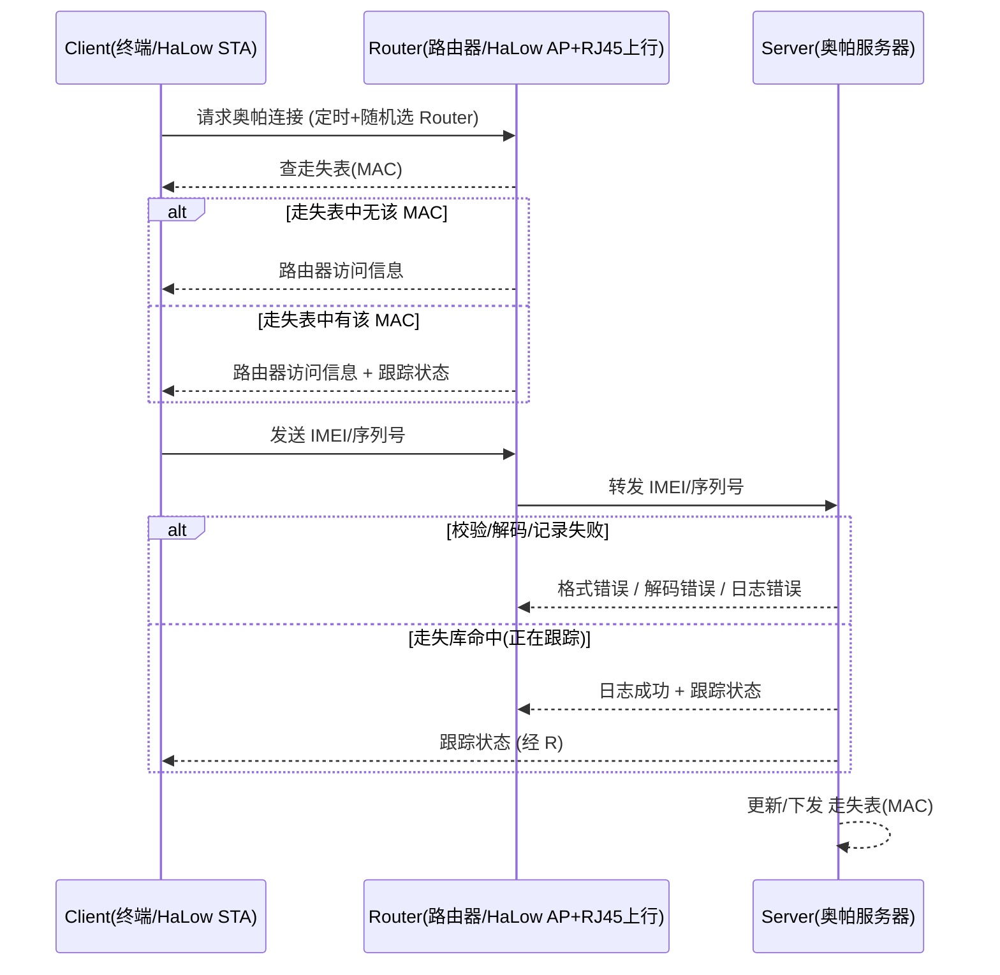

# ORPAH-over-HaLow 协议规格（草稿 → L1/L2/L3 实测回填）

- 状态：**v0.7**（2026-09-12）· L1/L2 已在 `halow-demo/simulator/orpah` 实现并验收
  （`demo_l1.py` / `demo_l2.py` PASS）；**L3（多 Router 漫游/去重 + SN 字符集）已落地**
  （`demo_l3.py` PASS，F-01/F-04/F-07 定稿）；**L3b（Router 主动拉取 LOST-TABLE）已落地**
  （`demo_l4.py` PASS，F-03 补充）；**L3c（发现走失上报 ORPAH-FOUND）已落地**（UI「发现记录」，
  见 §5/§7/§9/§10）；**SN 码号已对齐《Orpah ID 协议规范》v1.7（`CC-ORG-UNIQUE[-CHECK]`）**；
  报文字段/走失表流程按实测回填（§5/§6/§7）；**撤销表（CRL）分发方向已定、代码未写**（§5.1/F-10）。
- 文档负责人：shijh（Orpah）
- 关联：`halow-demo`（L1/L2/L3/L3b 原型与测试台，成熟后抽离）；泰芯 TX-AH / TH-RJ45（Phase1 硬件）；
  `OrpahIDProtocol.md`（SN 码号与签名层，SN 格式以其为准）
- 本文件是「可实现的 ORPAH-over-HaLow」规格：L0 骨架已按 L1/L2/L3 实测填充为可实现的
  报文定义（JSON + UDP 传输）；仍待决点见 §10 开放问题。

---

## 0. 背景与目标

- **渊源**：ORPAH（奥帕）原协议基于 Wi-Fi 802.11b（约 2016-2017 概念，见本仓根 README 与
  `docs/OrpahProtocol*.odg`）。当时（同期）长距低速率 Sub-1GHz 无线先后兴起——Wi-Fi HaLow(802.11ah)
  与 **LoRa** 等类似技术都属"远距离 + 低功耗/低速率"路线；如今泰芯 TX-AH/TH-RJ45 等 802.11ah 芯片
  已具备完整落地条件。
- **选型注记**：LoRa 也是远距低速率方案，但它是私有/非 802.11 链路，难以直接接入既有 Wi-Fi/以太网/IP
  生态；**ORPAH 选 HaLow(802.11ah)** 因其是**标准 Wi-Fi**，能复用 Wi-Fi 路由/桥接/IP 上行模型——
  恰好契合原 ORPAH「被改装的无认证 Wi-Fi 路由器 + 互联网上行」的架构。
- **ORPAH 目标**：追踪**走失儿童 / 阿尔茨海默走失者**。覆盖约 **1km** 级；客户端**低功耗、目标可免电池**
  （嵌入项链/鞋/钮扣/手表）；借助**可协作的路由器**（无需客户端预订阅/认证）把信号上报到云端服务器。
- **ORPAH-over-HaLow** = 把原协议的时序/语义落到 **802.11ah** 物理层与数据面，形成可实现的规范。

## 1. 范围与非目标（Phase 1）

**范围内（Phase 1）**
- 制定 ORPAH-over-HaLow **报文集 / 字段 / 编码 / 状态机 / 走失表流程**。
- 以**泰芯**芯片（TX-AH 客户端 / TH-RJ45 路由器）为参考实现验证载体。
- 服务器以 **Python** 实现（走失库 + 跟踪状态 + 日志），先本地/局域网跑通。

**范围外（Phase 1 不做，另行规划）**
- **免电池客户端**的真硬件与能量采集（仅预留接口与低功耗设计目标；方案方向 = TX-AH + CH32V203）。
- 大规模部署 / 漫游 / 联邦多服务器等。
- 完整安全与隐私方案（见 §8，先列威胁与开放项，不拍死）。

## 2. 术语与角色映射

| ORPAH 概念 | HaLow 实现 | 说明 |
|---|---|---|
| 终端 Client（可穿戴/无电池） | HaLow **STA** | 免电池方向 = 泰芯 TX-AH(电台) + CH32V203(主机/SPI 数据面) |
| 路由器 Router | HaLow **AP** + 互联网上行 | 典型 = TH-RJ45（AP + RJ45 上行）；查「走失表」(按 MAC) |
| 奥帕服务器 Server | 云端 / 本地 Python | 走失数据库、IMEI/序列号校验、跟踪状态、日志 |
| "无认证接入" | HaLow **开放网络** | 仅需 SSID 一致即可关联，无需预共享/订阅 |

**Client / Router / Server** 均可是多个；协议需容忍「一个 Client 随机选到多个 Router」「一个 Router
服务多个 Client」。

## 3. 网络与物理层假设（含实测约束）

- 802.11ah：中心频率 908/916/924MHz（`AT+CHAN_LIST` 用 ×10，如 9080），带宽 **1/2/4/8 MHz**；
  低速率换来长距与低功耗；实测桌面近距离 RSSI ≈ -68…-86 dBm（TH-RJ45 报小整数，非 dBm，注意归一）。
- **实测硬约束（必须写进设计）**：
  1. TX-AH（fmac 固件）**AT 无数据面**——payload 只能走 **host SPI(MACBUS)**（CH32 主机）。
  2. TH-RJ45 数据走 **RJ45 网口**（USB-C 仅 AT 配置）。
  3. **HaLow 互联只由固件代次决定（2026-09-09 四象限实测，取代早期“跨固件族不通”结论）**：
     AP/STA 同 SSID halowlink@9080 open 实测——**同代必通、跨代必不通，与 WNB/FMAC 族无关**：
     V1.6-WNB↔V1.6-FMAC 通、V2.4-WNB↔V2.4-FMAC 通、V1.6-WNB↔V2.4-FMAC 不通、
     V2.4-WNB↔V1.6-FMAC 不通（STA 恒 DISCONNECT / AP No pair STAs）。
     → 早期“TH-RJ45(v1.6.4.3) 连不上 TX-AH(v2.4.1.5)”纯系代次不匹配，**升同代（V2.4）即解**；
     WNB 固件必须配 RJ45 PHY 载板（TX-AH 载体烧 WNB 会 boot 循环），FMAC 才对 TX-AH 载体。
- 结论：数据面与“控制面 AT”解耦；协议实现主要跑在 **host/网桥之上**，802.11ah 仅提供 RF 数据通道。
  **Phase-1 在纯 PC 模拟器上开发验证协议逻辑**（`halow-demo/simulator/orpah`，零硬件）；
  真机最终形态链路 = Router 用 TH-RJ45（升 **V2.4-WNB**）+ Client 用 TX-AH（**V2.4-FMAC**）
  即可互通（不再依赖“同族 TH↔TH”限制，见 §9/F-09）。

## 4. 高层消息流（源自 ORPAH 原图语义）

**待补充（非 L3 阻塞）**：触发/重试策略、RSSI/时间上报的具体语义细化（见 §10）。
多 Router 去重/最新位置与漫游式选路已在 **L3** 定稿（见 §7、F-04/F-07）。

**L2 实测落地（2026-09-10，`halow-demo/simulator/orpah`）**：本时序已端到端跑通
（`demo_l2.py`）：REQ-CONNECT → Router 查本地走失缓存回 ACCESS-INFO → REPORT →
Server 查权威走失库回 TRACKING-STATUS（经 Router 空口下行回 Client）；Server 走失库
变更（mark/untrack）→ 下发 LOST-TABLE → Router 更新缓存，下一周期 ACCESS-INFO.tracked
随之变化。上行经 host 数据口注入 STA 空口、下行由 Router 注入 AP 空口广播回 Client
（单客户端 demo 用广播；多客户端需单播寻址，F-07 关联）。

**L3 实测落地（2026-09-10，`demo_l3.py`：2×AP+2×Router 共用 1 Server）**：漫游式
多 Router——同一 Client（同 sn）先后经 R1→R2 两网上报，Server 以**上报来源**为该 sn
的**当前 Router**（最新位置优先），回执只回当前 Router（旧 Router 不再收到该 sn 下行，
F-07）；按 **(sn,seq)** 去重——重复上报（同一 Router 重发 / 另一 Router 迟到转发同一帧）
丢弃，不重复计数、不再回 TRACKING-STATUS、不把当前 Router 切回旧 Router（F-04）；
新 Router 首报即被推送当前走失表追平（F-03 补充）。

## 5. 报文集（L2 实测 schema，JSON 统一公共头）

**公共头**：每个报文是单行 JSON，含 `v`(协议版本=1)、`type`、`ts`(unix 秒)；`sn`(客户端
序列号，见 F-01) 除 LOST-TABLE / LOST-TABLE-REQ（Router 级，无 sn）外均带。链路层封装 =
以太网帧(ethertype `0x88B5`) 经 HaLow
桥透传；Router↔Server 的 UDP 载荷 = 同一 JSON bytes（桥/网透传不改写）。

| 方向 | 报文 | 含义 | 字段（L2 实测） |
|---|---|---|---|
| C→R | `ORPAH-REQ-CONNECT` | 请求连接（无认证） | v,type,sn,ts,mac?,hw? |
| R→C | `ORPAH-ACCESS-INFO` | 路由器访问信息 | v,type,sn,ts,tracked,server_ok,status? |
| C→R/S | `ORPAH-REPORT` | IMEI/序列号上报 | v,type,sn,ts,seq,rssi? |
| S→R→C | `ORPAH-TRACKING-STATUS` | 跟踪状态回执 | v,type,sn,ts,status,msg? |
| 任→任 | `ORPAH-ERROR` | 错误 | v,type,sn?,ts,code,msg? |
| S→R | `ORPAH-LOST-TABLE` | 走失表下发/更新 | v,type,ts,entries:[{sn,tracked,note?}],version? |
| R→S | `ORPAH-LOST-TABLE-REQ` | Router 主动拉取当前走失表（F-03/L3b） | v,type,ts |
| R→S | `ORPAH-FOUND` | Router 发现走失设备（业务告警，每次命中都发，L3c） | v,type,sn,ts |

示例（REPORT）：`{"v":1,"type":"ORPAH-REPORT","sn":"CN-WH01-9AF3C1D2","ts":1788961894,"rssi":-55,"seq":1}`

- **status 状态码（TRACKING-STATUS）**：`TRACKED`（走失库命中）/ `NOT-TRACKED`（未命中）；
  校验/记录错误用 `ERROR` 报文的 code 字段（见下）。
- **ERROR code**：`FORMAT-ERR` / `DECODE-ERR` / `LOG-ERR` / `SERVER-ERR`。
- **SN 码号（对齐《Orpah ID 协议规范》v1.7，取代早前“中文/英文/数字”自定义）**：
  SN = **`CC-ORG-UNIQUE[-CHECK]`**——CC=ISO 3166-1 alpha-2；ORG 2–6 位、UNIQUE 8–16 位、
  CHECK 0–2 位（Crockford Base32，去除易混的 `I L O U`）。Server 收 REPORT 时校验
  （`orpah_proto.sn_err`，原因 empty / too-long / bad-format），非法 → ERROR
  code=`FORMAT-ERR`（msg_text `bad-sn:<原因>`）且不计数。**中文/姓名不进 SN**（放 payload
  业务字段，按 Orpah ID 的 NFKC/JCS 处理）；默认示例 SN = `CN-WH01-9AF3C1D2`。
- **编码**：Phase 1 用 **UDP+JSON**（已定，见 §6 选项 A）最快验证语义；免电池版再优化为
  紧凑二进制（选项 B，Phase 2）。

### 5.1 未实现（已定方向，2026-09-12 定，代码未写）：撤销表（CRL）分发到 Router

**现状缺口**：吊销只在 **Server** 侧生效 —— Router **不知道**某 SN 已撤销，仍会照常转发其上报，
由 Server 拒签兜住（能兜住，但不是最小权限，也白占上行链路）。

**已定方向**：与走失表 `LOST-TABLE` **完全同构**，但**语义分开**（走失表=业务数据、
撤销表=安全数据，混在一张表里以后难拆）。下表是**拟定 schema，尚未实现**（故不并入上面的实测表）：

| 方向 | 报文 | 含义 | 字段（拟定） |
|---|---|---|---|
| S→R | `ORPAH-CRL` | 撤销表下发/更新（变更即全量） | v,type,ts,entries:[{sn,revoked_at,reason?,gen?}],version? |
| R→S | `ORPAH-CRL-REQ` | Router 主动拉取撤销表（启动 / 尚未同步） | v,type,ts |
| R→S | `ORPAH-REVOKED-SEEN` | 收到已撤销设备的上报、已拒收（安全事件） | v,type,sn,ts,seq? |

- **Router 行为（已定）**：命中撤销表 → **不转发**该上报 + 本地计数 + 向 Server 报一条
  `ORPAH-REVOKED-SEEN`。「有人在用已撤销设备」本身就是安全线索 —— **静默丢弃会丢失可见性**。
- **拉取时机**：照抄 L3b 的教训 —— 启动拉一次 + Server 变更推送；**同步过就不再按条拉**
  （否则空表下每条 REQ-CONNECT 都拉一次 → 洪泛，L3b 实测踩过）。
- **Server 仍是最终防线**：Router 离线/新部署未同步时，Server 收到已撤销 SN 的 REPORT 一律拒签。
- **与本文件 §8 的开放问题无关**，别混：本条管**收/不收**（身份是否还可信），
  「路由器侧观测不入签名」管**观测是否可信**。
- **真机侧（不进 Phase 1）**：私钥不可导出（安全元件）、产线烧录与供应链绑定 = 硬件信任根，
  按 `halow-demo/ROADMAP.md` §〇 范围原则**不在本 demo 范围**，仅记录。

## 6. 传输与封装（已定：选项 A，UDP+JSON）

- **选项 A（Phase 1 采用，已实现）**：Client 关联 Router 的开放网络 → 经桥/网走 **IP/UDP**；
  Server 固定端口收报文，回执/走失表也走 UDP。实现：Router 桥用同一 UDP socket 上行转发 +
  收 Server 应答（Server `_reply` 回该 Router 源地址）；Client↔Router 段在纯 PC 用 host 数据口
  注入/收取（语义 = SPI MACBUS DATA_TX/DATA_RX，将来换真机只换底层收发）。
- **端口/约定（L1/L2 实测）**：Server UDP 默认 **19447**（可 --port 覆盖）；报文为单行 JSON；
  HaLow 桥内以太网帧 ethertype **0x88B5**（Local Experimental）；客户端上行以太网帧目的 MAC
  缺省广播 FF*6（demo 单客户端）。
- **选项 B（免电池/低功耗优化）**：链路层之上自定义小帧（省电省字节），依赖 host SPI 数据面
  打通；Phase 2 做。
- 仍待定：DHCP/静态 IP。多 Router 上行去重已在 L3 定稿（F-04，见 §7）。

## 7. 走失表 / 数据库（L2 落地流程）

- **权威在 Server**：内存表 `sn -> {tracked, note, since}`；`mark_tracked(sn)` / `untrack(sn)`
  由 UI/脚本调用（Server 命令行 --mark 可启动即标记）。
- **下发机制（F-03 已落地）**：走失表变更（mark/untrack）→ Server 主动把**全量** LOST-TABLE
  推给所有见过（上报过）的 Router；Router 存本地缓存 `sn -> tracked`，在 REQ-CONNECT 阶段
  据此直接回 ACCESS-INFO.tracked，不必每次问 Server。过期/按 sn 子集下发待 F-03 后续细化。
- **Router 主动拉取（F-03 补充，L3b 2026-09-10 落地）**：Server 只在「变更」或「新 Router
  首报」时主动推——若 Router 重启（缓存清空）或此前从未接触 Server、且期间无变更事件，
  将一直是空表 → 对已 mark 的 sn 误答 NOT-TRACKED。补：Router 可发 **`ORPAH-LOST-TABLE-REQ`**
  主动拉取，Server 记入见过集（此后变更也推）并回当前全量表。Router 触发时机 = **启动即拉
  一次**（重启追平；Server 未就绪则超时忽略）+ **尚未同步时（重启后 / 启动拉表失败）的首个
  REQ-CONNECT 再拉一次**（此后每次变更 Server 都会推全量表，无需每条 REQ 都拉——避免空表下
  的重复拉取洪泛）。
- **跟踪回执**：REPORT → Server 查库 → TRACKING-STATUS（TRACKED / NOT-TRACKED）经 Router
  下行回 Client。
- **多 Router 去重 / 最新位置（F-04/F-07 定稿 2026-09-10，L3 落地）**：Client 同一时刻只
  关联 1 台 Router，漫游表现为同一 sn 的**上报来源随时间切换**（R1→R2）。Server 以**上报
  来源**为该 sn 的**当前 Router**（最新位置优先），回执/下发只回当前 Router；并按
  **(sn,seq)** 去重——同一 Router 重发或另一 Router 迟到转发同一帧均丢弃（不重复计数、
  不再回 TRACKING-STATUS、不把当前 Router 切回旧 Router）。**新 Router 首报即被推送当前
  走失表**（追平，避免 REQ-CONNECT 时本地缓存为空误答 NOT-TRACKED）。seq 为 Client 侧
  递增序号（重启可回绕；Server 每 sn 保留最近 256 个 seq 窗口）。

## 8. 安全与隐私（先列威胁，方案另节填）

- 无认证开放网络的**滥用/伪造上报**（伪 SN、刷位置；SN 为自定义中英数字、无防伪强度，
  见 §5 F-01）→ 上报签名/频率限制（F-05）。
- **走失者位置隐私**：谁有权查询、数据保留期限、最小化（F-06）。
- 传输是否加密（UDP 明文 vs 后续加密）→ 与 §6 一并定。

## 9. 实现计划与进度（L1/L2 放 `halow-demo`，成熟后抽离 `orpah-demo`）

- **L1 数据通路最小骨架（✅ 已完成，`halow-demo/simulator/orpah`）**：纯 PC 模拟器内建
  AP+STA，Client 上行 payload 到 Python Server；`demo_l1.py` PASS。零硬件即可开发验证协议。
- **L2 全消息流（✅ 已完成 2026-09-10）**：报文集（§5 全集）+ 权威走失表 + 跟踪状态 + 双向
  下行，端到端跑通 §4 时序；`demo_l2.py` 两分支 PASS（未命中 NOT-TRACKED / mark 后 TRACKED）。
  UI（orpah/ui_server.py :8901）加消息流面板 + 走失表标记/取消。
- **L3（多 Router 选路/去重 + SN 字符集，✅ 已完成 2026-09-10）**：漫游式双 Router
  （2×AP+2×Router 共用 1 Server）验证 F-04/F-07（(sn,seq) 去重/最新 Router/回执归属）
  + F-01（SN 码号校验）；`demo_l3.py` 7 项检查全 PASS。
- **L3b（Router 主动拉表，✅ 已完成 2026-09-10）**：新增 `ORPAH-LOST-TABLE-REQ`；Router
  启动即拉、未同步（重启后）时首个 REQ-CONNECT 再拉一次（避免每条 REQ 都拉），Server 记入
  见过集并回全量表；`demo_l4.py` 4 项检查全 PASS。UI「走失表」卡片加「服务器发布记录」显示
  LOST-TABLE 下发（mark/untrack 发布；逐条 TRACKING-STATUS 回执属响应、不计不展示）。
- **L3c（发现走失上报，✅ 已完成 2026-09-10）**：Router 在 REQ-CONNECT **命中本地走失缓存**
  （tracked）时即上报 `ORPAH-FOUND`（**每次命中都发**，业务告警 = “某 Router 发现走失者”）；
  Server 记录/计数。UI 加「发现记录（走失命中）」feed + Router 卡「发现 N 次」。
- **L3d（撤销表分发到 Router，📝 方向已定 2026-09-12，代码未写）**：新增 `ORPAH-CRL`(S→R 推) /
  `ORPAH-CRL-REQ`(R→S 拉) / `ORPAH-REVOKED-SEEN`(R→S 安全事件)，与 LOST-TABLE 同构；
  Router 命中撤销表 → 不转发 + 计数 + 上报安全事件（详见 §5.1 / F-10）。
  **当前实现状态**：吊销只在 Server 侧生效（Server 拒签兜住），Router 仍会转发。
  实现落点：`halow-demo/simulator/orpah/{orpah_proto,server,router}.py` + 端到端脚本 `demo_l5.py`。
- **不进 demo 范围（仅记录）**：设备侧私钥不可导出（安全元件）、产线烧录与供应链绑定 = 硬件信任根，
  按 `halow-demo/ROADMAP.md` §〇 范围原则不实现。
- **L2.5 / 真机最终形态（下一步）**：固件代次结论（§3）已解锁最终链路——Router=TH-RJ45 升
  **V2.4-WNB**、Client=TX-AH **V2.4-FMAC**，数据面走 host SPI / RJ45 网口（orpah host 数据口
  语义已对齐 SPI MACBUS，可平滑替换底层）。
- **L3（真机前续，规划）**：免电池客户端(TX-AH+CH32V203)低功耗策略；F-05 防伪造/限频、
  F-06 隐私、F-08 RSSI 粗定位。

## 10. 开放问题清单

| # | 问题 | 归属 | 状态 |
|---|---|---|---|
| F-01 | 身份标识（SN 码号）？ | §5 | **已定**：SN=`CC-ORG-UNIQUE[-CHECK]`（Crockford Base32），对齐《Orpah ID 协议规范》v1.7；Server 校验非法回 FORMAT-ERR（2026-09-10 对齐） |
| F-02 | 传输=UDP+JSON(A) vs 链路层小帧(B)？端口/长度？ | §6 | **已定 = A（UDP+JSON）**，Server 端口 19447 |
| F-03 | 走失表如何下发/过期/撤销到 Router？ | §7 | 变更即全量下发（L2）+ 新 Router 首报追平（L3）+ **Router 主动拉取（启动/缓存未命中，L3b）**；按子集/过期待细化 |
| F-04 | 多 Router 上报去重 / 最新位置策略？ | §7 | **已定（2026-09-10）**：(sn,seq) 去重 + 上报来源=当前 Router（最新位置优先）+ 新 Router 首报追平（L3 落地） |
| F-05 | 防伪造/刷位置上报（签名/限频）？ | §8 | 待定 |
| F-06 | 位置隐私与查询权限模型？ | §8 | 待定 |
| F-07 | Client 如何“随机选 Router”（多 AP 扫描）？ | §4/§9 | **已定（2026-09-10）**：漫游式——同 sn 上报来源随时间切换（demo_l3 双 Router 演示）；真机多 AP 扫描/按 RSSI 选路列入 L2.5 细节 |
| F-08 | RSSI 定位：多 Router 信号→粗定位，数据模型？ | §4/§7 | 待定 |
| F-09 | **跨固件互联（TX-AH↔TH-RJ45）——已由代次结论解决（2026-09-09）**：非家族不兼容，
  系 V1.6↔V2.4 代次不匹配；Router=TH-RJ45 升 V2.4-WNB、Client=TX-AH 用 V2.4-FMAC 即互通。
  真机最终形态验证列入 L2.5。 | §3/§9 | **已解决（升同代）**，L2.5 真机验证待做 |
| F-10 | 撤销表（CRL）如何下发到 Router？Router 收到已撤销设备的报怎么处理？ | §5.1 | **已定（2026-09-12，代码未写）**：新报文 `ORPAH-CRL`(S→R 推) + `ORPAH-CRL-REQ`(R→S 拉) + `ORPAH-REVOKED-SEEN`(R→S 安全事件)，与 LOST-TABLE 同构；Router 命中即**不转发 + 计数 + 上报安全事件**。私钥不可导出/安全元件/产线烧录**不在本 demo 范围**（硬件信任根） |

## 附：本文件填充路线

1. 定 §6（传输）→ 回填 §5 报文字节定义 → 补 §4 时序细节
2. 定 §7（走失表）与 §8（安全最小集）
3. 按 §9 在 halow-demo 落 L1 → L2，实测回填"实测约束"章节
4. 评审后拆分为正式多章节规格（overview / message / state / lost-table / server-api …）
