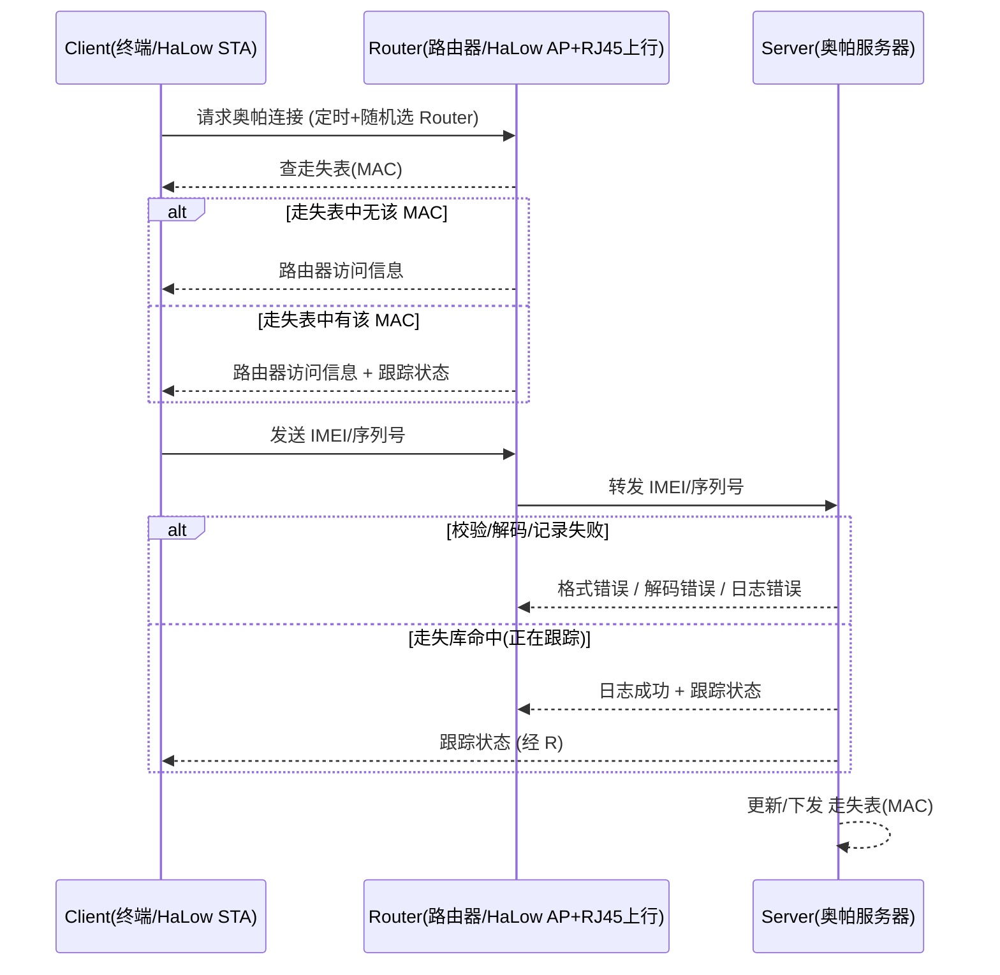

# ORPAH-over-HaLow 协议规格（草稿 → L1/L2/L3 实测回填）

- 状态：**v0.7.11**（2026-09-13）· L1/L2 已在 `orpah-over-halow` 实现并验收
  （`demo_l1.py` / `demo_l2.py` PASS）；**L3（多 Router 漫游/去重 + SN 字符集）已落地**
  （`demo_l3.py` PASS，F-01/F-04/F-07 定稿）；**L3b（Router 主动拉取 LOST-TABLE）已落地**
  （`demo_l4.py` PASS，F-03 补充）；**L3c（发现走失上报 ORPAH-FOUND）已落地**（UI「发现记录」，
  见 §5/§7/§9/§10）；**SN 码号已对齐《Orpah ID 协议规范》v1.17（`CC-ORG-UNIQUE[-CHECK]`）**；
  报文字段/走失表流程按实测回填（§5/§6/§7）；**能力位 `cap`（设备自报有无 RTC）已加**（§5，2026-09-13）；**能量轴（免电池客户端的电量语义：降级可见 / 下限 L1 / 沉默归因分叉）已定并实现**（§5.2，2026-09-13，参数为演示标定值）；**撤销表（CRL）分发方向已定、代码未写**（§5.1/F-10）；
  **2026-09-13（本次）：§10 开放问题逐条结案** —— F-05/F-06/F-08 按已有实现落笔定稿，
  新增 **F-12（路由器侧观测 `xport` 不在签名内 → 可伪造定位）** 与 **F-13（密钥轮换口径不一致：
  `OrpahIDProtocol.md` §6.3.1 说「不轮换」，而 demo 已实现多代轮换 —— 待拍板）**；
  §8 由「先列威胁，方案另节填」改为**威胁 + 本 demo 实现现状 + 如实记录的缺口**
  （规范正文在《Orpah ID 协议规范》v1.18，本文件不复制）；
  **同日晚：确立项目原则「孤证不立」（§8 原则 P-1）** —— 单条**机器**证据不足以支撑位置判定，
  且**唯一例外**是「证据明确来自人（办案人/搜救队）」；据此 **F-12 结案为「多观测一致性判定 +
  离群剔除」，任一 `xport` 永不单独采信**，并**否决**《Orpah ID 协议规范》§5.7 的
  「受信 router 集合」白名单（该文档相应升至 v1.18，两处口径一致）；
  **同日晚续：一致判定算法落地** —— `orpah-over-halow/ui/static/pos.js` 的 `consensus()`
  （离线用例见 `test_posjs.py`，现 **81** 条），判据定为 **留一法标准化残差**
  （σ **锚在其余台推出的距离上**）；
  **2026-09-13 再续（v0.7.9）：阈值改为按实测零假设分布标定** —— “定罪阈值 = 3σ_rel”改为
  **z ≥ 5**：实测诚实场景 max-z 的上界 ≈ **3.8 且与噪声幅度无关**（±1/±2/±4 dBm 同样），
  故 3 会误报（实测诚实满网格 11% 被误剔除）、5 则不误报（**5 千多个诚实样本零误报、零“残差偏大”误报**）。
  同时量清了**三条能力边界**（全部写进 §8 威胁 2）：
  ① **“偏得更近”在数学上不可分辨** —— 它的误差上限就是它自己报的距离，z 有上界（实测最大 ≈3.8，
     与诚实尾部重合）→ 无论怎么调阈值都拓不到（×0.25/×0.1 实测 **864/864 全漏**，如实不报，
     不编“已防住”）；② “偏得更远”无上界 → 可靠可检（4 台 77%、5 台 87%；噪声 ±4 dBm 时 4 台降到 60%）；
  ③ **多台同时偏大**（n=4 里 2 台）属信息论边界（n−k≥3 才能定位）→ 定不了是哪台，
     但**拟合残差 σ0 会变大**（诚实 0.2~0.8 vs 2 台偏大 1.5~2.2）→ 页面按实测阀值 **1.8** 报
     「拟合偏松」这一**事实**（不指认哪台、不保证每帧都报）。
  另一处实测修正：z 的分母必须含**预测的不确定度**（`wlsLocate` 协方差沿“预测点→本台”方向的投影
  ⊕ σ0 放大）—— 只看本台测距噪声时，其余台里混着偏大的一台会把**好台**算出大 z（实测好台 z=9.3
  与真偏那台 12.0 分不开）→ 误剔除 11%（其中路线区域 28%）；补上后归零。
  **同日再续（v0.7.10）：术语与归因口径** —— 用户指出“偏差大”≠“有人作恶”：现实里成因很多
  （**遮挡/多径、天线损坏或接头松、元件性能下降/老化、标定漂移**，以及其中一种 = 被改装/冒充），
  而本 demo 的信号模型（A/n 对数路径损耗）**只假定空旷无遮挡、未建遮挡与多径**。
  故全库（代码/页面/文档）**禁用“谎报/撒谎/作弊/有罪”这类归因性词**，统一用
  **偏差 / 不一致 / 离群 / 对不上**；判据**只判“与其余观测不一致”，不判原因**，
  结果一律成“仅线索、需人工复核”。
  **同日再续（v0.7.11）：F-13 结案 = 【不轮换】（以《Orpah ID 协议规范》§6.3.1 为准）** ——
  设备侧只持有 **1 把 ECDSA P-256 私钥（Slot 0） + 1 把 32 字节 HMAC 密钥（降级用）**，
  一代终身，“不存在第 2 代”。除原有三条理由（系统目标优先 / 简化运维 / 硬件 Slot 资源）外，
  用户 2026-09-13 补两条：
  ① **本系统对使用者无强制约束力** —— 觉得不好用/不想用，**抛弃客户端或物理屏蔽（包锡纸）**即可，
    所以**不需要靠轮换去应对“疑似泄露”**，轮换只会给愿意用的人制造失联风险；
  ② **免电池/取能终端做不了轮换** —— 轮换是“**高能耗 + 必须在线完成一次事务**”（生成新钥 →
    上行公钥 → 等 server 确认/绑定 → 按 server 指定时刻切换），而取能设备采集功率是波动的，
    **承诺不了“换钥那一刻我有电”**（就是能量轴里 `P = 0` 的情形）。
  → **demo 里的 `rotate`/`grace`/`retired` 降为“对比用的演示代码，不是设备模型”**，
  不得基于它继续加功能；真机与本文档以【不轮换】为准（规范同步升 **v1.19**）。
  实现里测出的硬边界已回写 §8 威胁 2（**不能用「单台残差 > k·σ」**、**σ 不能锚在它自报的距离上**、
  **识别单台离群需 ≥4 台站位**）；**演示场景已随之从 3 台加到 4 台**（`ui_server.DEMO_STATIONS`，
  第 4 台位置按「剔掉任意一台后剩 3 台的几何」选：西侧 `(-20,0)` 最坏 3 台子集 GDOP 1.89）；
  **2026-09-12：业务侧从 `halow-demo/simulator/orpah/` 整体迁到独立仓库 `orpah-over-halow`**
  （`git subtree split` 保留历史；本规格里的实现路径随之更新。`halow-demo` 保留空口/设备侧，
  两者通过 host 数据口（TCP，SPI MACBUS 语义）相接）。
- 文档负责人：shijh（Orpah）
- 关联：`orpah-over-halow`（L1/L2/L3/L3b 业务原型与测试台；2026-09-12 从 halow-demo 迁出）；
  `halow-demo`（空口/设备侧权威源，长距与真机链路）；泰芯 TX-AH / TH-RJ45（Phase1 硬件）；
  `OrpahIDProtocol.md`（**《Orpah ID 协议规范》v1.17**：SN 码号、签名/验签、alg 白名单、
  限频、四级降级、定位数据源、威胁模型 —— 这几项以其为准，本文件不复制）
- 本文件是「可实现的 ORPAH-over-HaLow」规格：L0 骨架已按 L1/L2/L3 实测填充为可实现的
  报文定义（JSON + UDP 传输）；仍待决点见 §10 开放问题。

---

## 0. 背景与目标

- **渊源**：ORPAH（奥帕）原协议基于 Wi-Fi 802.11b（约 2016-2017 概念，见本仓根 README 与
  `docs/OrpahProtocol*.odg`）。当时（同期）长距低速率 Sub-1GHz 无线先后兴起——Wi-Fi HaLow(802.11ah)
  与 **LoRa** 等类似技术都属"远距离 + 低功耗/低速率"路线；如今泰芯 TX-AH/TH-RJ45 等 802.11ah 芯片
  已具备完整落地条件。
- **选型注记**：LoRa 也是远距低速率方案，但它是私有/非 802.11 链路，难以直接接入既有 Wi-Fi/以太网/IP
  生态；**ORPAH 选 HaLow(802.11ah)** 因其是**标准 Wi-Fi**，能复用 Wi-Fi 路由/桥接/IP 上行模型——
  恰好契合原 ORPAH「被改装的无认证 Wi-Fi 路由器 + 互联网上行」的架构。
- **ORPAH 目标**：追踪**走失儿童 / 阿尔茨海默走失者**。覆盖约 **1km** 级；客户端**低功耗、目标可免电池**
  （嵌入项链/鞋/钮扣/手表）；借助**可协作的路由器**（无需客户端预订阅/认证）把信号上报到云端服务器。
- **ORPAH-over-HaLow** = 把原协议的时序/语义落到 **802.11ah** 物理层与数据面，形成可实现的规范。

## 1. 范围与非目标（Phase 1）

**范围内（Phase 1）**
- 制定 ORPAH-over-HaLow **报文集 / 字段 / 编码 / 状态机 / 走失表流程**。
- 以**泰芯**芯片（TX-AH 客户端 / TH-RJ45 路由器）为参考实现验证载体。
- 服务器以 **Python** 实现（走失库 + 跟踪状态 + 日志），先本地/局域网跑通。

**范围外（Phase 1 不做，另行规划）**
- **免电池客户端**的真硬件与能量采集（仅预留接口与低功耗设计目标；方案方向 = TX-AH + CH32V203）。
- 大规模部署 / 漫游 / 联邦多服务器等。
- 完整安全与隐私方案（见 §8，先列威胁与开放项，不拍死）。

## 2. 术语与角色映射

| ORPAH 概念 | HaLow 实现 | 说明 |
|---|---|---|
| 终端 Client（可穿戴/无电池） | HaLow **STA** | 免电池方向 = 泰芯 TX-AH(电台) + CH32V203(主机/SPI 数据面) |
| 路由器 Router | HaLow **AP** + 互联网上行 | 典型 = TH-RJ45（AP + RJ45 上行）；查「走失表」(按 MAC) |
| 奥帕服务器 Server | 云端 / 本地 Python | 走失数据库、IMEI/序列号校验、跟踪状态、日志 |
| "无认证接入" | HaLow **开放网络** | 仅需 SSID 一致即可关联，无需预共享/订阅 |

**Client / Router / Server** 均可是多个；协议需容忍「一个 Client 随机选到多个 Router」「一个 Router
服务多个 Client」。

## 3. 网络与物理层假设（含实测约束）

- 802.11ah：中心频率 908/916/924MHz（`AT+CHAN_LIST` 用 ×10，如 9080），带宽 **1/2/4/8 MHz**；
  低速率换来长距与低功耗；实测桌面近距离 RSSI ≈ -68…-86 dBm（TH-RJ45 报小整数，非 dBm，注意归一）。
- **实测硬约束（必须写进设计）**：
  1. TX-AH（fmac 固件）**AT 无数据面**——payload 只能走 **host SPI(MACBUS)**（CH32 主机）。
  2. TH-RJ45 数据走 **RJ45 网口**（USB-C 仅 AT 配置）。
  3. **HaLow 互联只由固件代次决定（2026-09-09 四象限实测，取代早期“跨固件族不通”结论）**：
     AP/STA 同 SSID halowlink@9080 open 实测——**同代必通、跨代必不通，与 WNB/FMAC 族无关**：
     V1.6-WNB↔V1.6-FMAC 通、V2.4-WNB↔V2.4-FMAC 通、V1.6-WNB↔V2.4-FMAC 不通、
     V2.4-WNB↔V1.6-FMAC 不通（STA 恒 DISCONNECT / AP No pair STAs）。
     → 早期“TH-RJ45(v1.6.4.3) 连不上 TX-AH(v2.4.1.5)”纯系代次不匹配，**升同代（V2.4）即解**；
     WNB 固件必须配 RJ45 PHY 载板（TX-AH 载体烧 WNB 会 boot 循环），FMAC 才对 TX-AH 载体。
- 结论：数据面与“控制面 AT”解耦；协议实现主要跑在 **host/网桥之上**，802.11ah 仅提供 RF 数据通道。
  **Phase-1 在纯 PC 模拟器上开发验证协议逻辑**（`orpah-over-halow`，零硬件）；
  真机最终形态链路 = Router 用 TH-RJ45（升 **V2.4-WNB**）+ Client 用 TX-AH（**V2.4-FMAC**）
  即可互通（不再依赖“同族 TH↔TH”限制，见 §9/F-09）。

## 4. 高层消息流（源自 ORPAH 原图语义）

**待补充（非 L3 阻塞）**：触发/重试策略、RSSI/时间上报的具体语义细化（见 §10）。
多 Router 去重/最新位置与漫游式选路已在 **L3** 定稿（见 §7、F-04/F-07）。

**L2 实测落地（2026-09-10，`orpah-over-halow`）**：本时序已端到端跑通
（`demo_l2.py`）：REQ-CONNECT → Router 查本地走失缓存回 ACCESS-INFO → REPORT →
Server 查权威走失库回 TRACKING-STATUS（经 Router 空口下行回 Client）；Server 走失库
变更（mark/untrack）→ 下发 LOST-TABLE → Router 更新缓存，下一周期 ACCESS-INFO.tracked
随之变化。上行经 host 数据口注入 STA 空口、下行由 Router 注入 AP 空口广播回 Client
（单客户端 demo 用广播；多客户端需单播寻址，F-07 关联）。

**L3 实测落地（2026-09-10，`demo_l3.py`：2×AP+2×Router 共用 1 Server）**：漫游式
多 Router——同一 Client（同 sn）先后经 R1→R2 两网上报，Server 以**上报来源**为该 sn
的**当前 Router**（最新位置优先），回执只回当前 Router（旧 Router 不再收到该 sn 下行，
F-07）；按 **(sn,seq)** 去重——重复上报（同一 Router 重发 / 另一 Router 迟到转发同一帧）
丢弃，不重复计数、不再回 TRACKING-STATUS、不把当前 Router 切回旧 Router（F-04）；
新 Router 首报即被推送当前走失表追平（F-03 补充）。

## 5. 报文集（L2 实测 schema，JSON 统一公共头）

**公共头**：每个报文是单行 JSON，含 `v`(协议版本=1)、`type`、`ts`(unix 秒)；`sn`(客户端
序列号，见 F-01) 除 LOST-TABLE / LOST-TABLE-REQ（Router 级，无 sn）外均带。链路层封装 =
以太网帧(ethertype `0x88B5`) 经 HaLow
桥透传；Router↔Server 的 UDP 载荷 = 同一 JSON bytes（桥/网透传不改写）。

| 方向 | 报文 | 含义 | 字段（L2 实测） |
|---|---|---|---|
| C→R | `ORPAH-REQ-CONNECT` | 请求连接（无认证） | v,type,sn,ts,mac?,hw? |
| R→C | `ORPAH-ACCESS-INFO` | 路由器访问信息 | v,type,sn,ts,tracked,server_ok,status? |
| C→R/S | `ORPAH-REPORT` | IMEI/序列号上报 | v,type,sn,ts,seq,rssi?,**cap?** |
| S→R→C | `ORPAH-TRACKING-STATUS` | 跟踪状态回执 | v,type,sn,ts,status,msg? |
| 任→任 | `ORPAH-ERROR` | 错误 | v,type,sn?,ts,code,msg? |
| S→R | `ORPAH-LOST-TABLE` | 走失表下发/更新 | v,type,ts,entries:[{sn,tracked,note?}],version?,**rid?**（仅应答拉表时回显） |
| R→S | `ORPAH-LOST-TABLE-REQ` | Router 主动拉取当前走失表（F-03/L3b） | v,type,ts,**rid?**（关联号，2026-09-12 加） |
| R→S | `ORPAH-FOUND` | Router 发现走失设备（业务告警，每次命中都发，L3c） | v,type,sn,ts |

示例（REPORT）：`{"v":1,"type":"ORPAH-REPORT","sn":"CN-WH01-9AF3C1D2","ts":1788961894,"rssi":-55,"seq":1}`

- **status 状态码（TRACKING-STATUS）**：`TRACKED`（走失库命中）/ `NOT-TRACKED`（未命中）；
  校验/记录错误用 `ERROR` 报文的 code 字段（见下）。
- **ERROR code**：`FORMAT-ERR` / `DECODE-ERR` / `LOG-ERR` / `SERVER-ERR`。
- **SN 码号（对齐《Orpah ID 协议规范》v1.17（SN 规则自其 v1.7 起定稿），取代早前“中文/英文/数字”自定义）**：
  SN = **`CC-ORG-UNIQUE[-CHECK]`**——CC=ISO 3166-1 alpha-2；ORG 2–6 位、UNIQUE 8–16 位、
  CHECK 0–2 位（Crockford Base32，去除易混的 `I L O U`）。Server 收 REPORT 时校验
  （`orpah_proto.sn_err`，原因 empty / too-long / bad-format），非法 → ERROR
  code=`FORMAT-ERR`（msg_text `bad-sn:<原因>`）且不计数。**中文/姓名不进 SN**（放 payload
  业务字段，按 Orpah ID 的 NFKC/JCS 处理）；默认示例 SN = `CN-WH01-9AF3C1D2`。
- **编码**：Phase 1 用 **UDP+JSON**（已定，见 §6 选项 A）最快验证语义；免电池版再优化为
  紧凑二进制（选项 B，Phase 2）。
- **无 RTC 设备的 `ts`（2026-09-12 补）**：`ts=0`（或缺失）=
  **未知时钟** → 验签侧**跳过时间窗**（仅靠 nonce 防重放），**但收下不等于可以对 0 处理**：
  实现方必须把该上报的**记录时间取服务器接收时刻**，并在审计里标出时间来源（`ts_src=server`）；
  设备流与路由器侧观测序列必须用**同一个时刻**，否则依赖时间对齐的定位/回放会匹配不上。
  **不得改写报文里的 `ts`**（它在签名预像里，改了验签不过）。
- **能力位 `cap`（v0.7.2 新增，2026-09-13）**：设备**自报能力**，目前只定义一个字段：
  `cap = {"rtc": true|false}`（JSON 对象，**不用位图**，加能力不用改协议字位）。
  - **三态必须区分**：`true`=**有** RTC / `false`=**无** RTC / **缺省=未声明**（旧设备/旧固件）。
    **未声明 ≠ 无 RTC**：前者按“不一定准”处理（沿用上面那条对 `ts` 的判断），后者按下面的策略处理。
  - **必须进签名预像**：`cap` 放在**已签** ID 报告的 `payload` 内 → 篡改即验签失败。
    否则攻击者可把 `rtc:true` 改成 `false`（**降级攻击**：把“时钟异常”伪装成“本来就没时钟”）
    而不被发现。业务报文 `ORPAH-REPORT` **未签名**（Phase 1），其 `cap` 只能当**提示**（选时间口径），
    **不得**用于安全判定/告警。
  - **服务端策略**：声明 `rtc=false` ⇒ **一律**用服务器接收时刻（`ts_src=server`），
    **即使**该条的 `ts` 看着正常（没有参考时钟的设备报的“时间”不是时间基准，它可能是上电秒数）；
    并且**不得**把它的 `ts` 喂给时钟偏移/漂移估计（那会估出常数/噪声）。
  - **SHOULD：不一致检测**：声明 `rtc=true` 却送出不可用 `ts` ⇒ 设备故障/被动手脚 → 报运维告警；
    反向（`rtc=false` + `ts=0`）是**正常**（免电池终端的预期行为），**不得**告警。

### 5.1 未实现（已定方向，2026-09-12 定，代码未写）：撤销表（CRL）分发到 Router

> **⏸ 2026-09-13 用户定：往后放（不写代码）**。实测体积（按下面 entries schema 生成真实 JSON）：
> 单条 **76 B**，整表 50 条 **3.8 KB** / 100 条 **7.6 KB** / 1000 条 **75 KB** —— 约 50 条就超过
> 单个 1472 B 载荷（要分帧），而「变更即全量」意味着每撤一台就推一次整表；
> 且**可见性收益已由 Server 兑住**（Router 今天照常转发 → Server 看得到被拒上报并告警），
> 只剩「省上行空口」一项收益，demo 尺度下不值这个复杂度。
> **回头看它的触发条件**：已撤销设备数量到几十~上百台且仍在持续上报；或传输换成紧凑二进制（届时 76 B/条 会小很多）；
> 或出现「Router 必须自己拒绝」的最小权限要求。

**现状缺口**：吊销只在 **Server** 侧生效 —— Router **不知道**某 SN 已撤销，仍会照常转发其上报，
由 Server 拒签兜住（能兜住，但不是最小权限，也白占上行链路）。

**已定方向**：与走失表 `LOST-TABLE` **完全同构**，但**语义分开**（走失表=业务数据、
撤销表=安全数据，混在一张表里以后难拆）。下表是**拟定 schema，尚未实现**（故不并入上面的实测表）：

| 方向 | 报文 | 含义 | 字段（拟定） |
|---|---|---|---|
| S→R | `ORPAH-CRL` | 撤销表下发/更新（变更即全量） | v,type,ts,entries:[{sn,revoked_at,reason?,gen?}],version? |
| R→S | `ORPAH-CRL-REQ` | Router 主动拉取撤销表（启动 / 尚未同步） | v,type,ts |
| R→S | `ORPAH-REVOKED-SEEN` | 收到已撤销设备的上报、已拒收（安全事件） | v,type,sn,ts,seq? |

- **Router 行为（已定）**：命中撤销表 → **不转发**该上报 + 本地计数 + 向 Server 报一条
  `ORPAH-REVOKED-SEEN`。「有人在用已撤销设备」本身就是安全线索 —— **静默丢弃会丢失可见性**。
- **拉取时机**：照抄 L3b 的教训 —— 启动拉一次 + Server 变更推送；**同步过就不再按条拉**
  （否则空表下每条 REQ-CONNECT 都拉一次 → 洪泛，L3b 实测踩过）。
- **拉表关联号 `rid`（v0.7.1 新增，2026-09-12）**：Router 发 `ORPAH-LOST-TABLE-REQ` 时带一个
  随机 token，**Server 的应答原样回显**；**Server 主动推送不带 `rid`**。
  为什么需要它：两种下发对 Router 是**不同事件**（“我拉表的应答”不算“收到 Server 下发”，
  主动推送才算 —— 两端卡片上的「发布 N 次」↔「收到 N 次」要能对上）。
  旧实现靠“发出 REQ 后 ≤1.5s 内收到的表算应答”的**时间窗猜测**：推送恰好落在窗口内会被误算成
  应答（少计 1 次），反之也会多计 —— 改用 `rid` 后是确定配对（`repo` 内固定用法：
  `orpah_proto.new_rid()`）。“rid 不匹配”（过期的/别台的应答）按推送计。
- **Server 仍是最终防线**：Router 离线/新部署未同步时，Server 收到已撤销 SN 的 REPORT 一律拒签。
- **与本文件 §8 的开放问题无关**，别混：本条管**收/不收**（身份是否还可信），
  「路由器侧观测不入签名」管**观测是否可信**。
- **真机侧（不进 Phase 1）**：私钥不可导出（安全元件）、产线烧录与供应链绑定 = 硬件信任根，
  按 `orpah-over-halow/ROADMAP.md` §〇 范围原则**不在本 demo 范围**，仅记录。

### 5.2 能量轴（免电池客户端的电量语义，v0.7.3 新增 2026-09-13）

免电池终端（采集/储能 -> 定期上报）的**生存约束**与“身份/加密降级”是两件事，但会互相牵扯：
没电会让设备少报、降级、直至沉默。本节的规范对象是**如何在协议里如实表达能量**，而不是
具体电路/能量预算（那是实现细节，见 F-11）。

**字段**：沿用**已签**上报 `orpah-id-report` 的 `payload.battery_mv`（int，mV），语义 =
**设备自己的储能/电池电压**（不是外部电源电压、不代表供电是否接入）。

- 缺省 / 非整数 / `bool` = **未声明**；实现方**不得**猜、不得当成 0、不得用它触发告警。
- 在**签名预像内** -> 设备不能抵赖“我快没电了”，路由/服务器也不能篡改它来伪造“设备没电”。
- SHOULD：设备在**还能报的时候**如实报低电量。否则服务端只能按“健康设备突然沉默”处置
  （两者要采取的动作相反，见下“分叉”），会白跑一趟。

**规则 E1（降级必须可见）**：能量不足**可以**驱动降级（如 ES256 -> HS256 以省电），但
**必须显式可见**，即：

1. 真实级别写在**已签**上报头 `hdr.level`（设备不许“名义 L0、实际没签”）；
2. 成因**由签名覆盖内的两个事实推导**（级别 + 电量），而**不靠新增可被伪造的字段**；
3. 服务端 SHOULD 把“因为没电而省电”与“签名/密钥环节坏了”**分开归因**、分开告警。
   否则运维会把一台快没电的终端当成“被攻击/密钥损坏”去查，而真故障又淹在能量噪声里。

**规则 E2（能量不得降到 L3）**：能量紧张时降级的**下限是 L1（HS256）**。L3 =“无可用密钥”
按《Orpah ID 协议规范》§8.3 只能做**覆盖发现（coverage-only）**，**不算人员出现**；若允许能量导致 L3，则“人到了
但没电”会退化成一个**不能确认人是否在场**的上报 —— 对 ORPAH 的目标（找到人）是错的。宁可
**如实沉默**（服务端按沉默处置），也不要发一条无法确认在场的报。

**规则 E3（沉默必须归因分叉）**：设备沉默且**最后一条已签上报的电量低** -> 归因为
**疑似没电**（warn：等它取能/去换电池）；沉默但**电量充足** -> 归因为**异常失联**
（crit 升级：这才是该出警的那类）。两类**不得**合并成同一条告警（处置相反）。
- 服务端**只能**用最后一条**已签**电量做归因；设备如果一直没报过低电量就死了，服务端**无从知道**
  （会按异常失联处理）—— 这是诚实的代价，也是上一条 SHOULD 存在的原因。

**非规范（实现选择，可变）**：具体“采集→间隔→级别”的映射用三参数储能模型
（采集 P mW / 储能 C mJ / 每次上报代价 cost mJ）实现于
`orpah-over-halow/energy.py`；其中的参数是**演示标定值、不是实测值**
（真机标定见 F-11）。规范只要求上面的 E1/E2/E3 成立，**不**规定 P/C/cost 的数值。

## 6. 传输与封装（已定：选项 A，UDP+JSON）

- **选项 A（Phase 1 采用，已实现）**：Client 关联 Router 的开放网络 → 经桥/网走 **IP/UDP**；
  Server 固定端口收报文，回执/走失表也走 UDP。实现：Router 桥用同一 UDP socket 上行转发 +
  收 Server 应答（Server `_reply` 回该 Router 源地址）；Client↔Router 段在纯 PC 用 host 数据口
  注入/收取（语义 = SPI MACBUS DATA_TX/DATA_RX，将来换真机只换底层收发）。
- **端口/约定（L1/L2 实测）**：Server UDP 默认 **19447**（可 --port 覆盖）；报文为单行 JSON；
  HaLow 桥内以太网帧 ethertype **0x88B5**（Local Experimental）；客户端上行以太网帧目的 MAC
  缺省广播 FF*6（demo 单客户端）。
- **选项 B（免电池/低功耗优化）**：链路层之上自定义小帧（省电省字节），依赖 host SPI 数据面
  打通；Phase 2 做。
- 仍待定：DHCP/静态 IP。多 Router 上行去重已在 L3 定稿（F-04，见 §7）。

## 7. 走失表 / 数据库（L2 落地流程）

- **权威在 Server**：内存表 `sn -> {tracked, note, since}`；`mark_tracked(sn)` / `untrack(sn)`
  由 UI/脚本调用（Server 命令行 --mark 可启动即标记）。
- **下发机制（F-03 已落地）**：走失表变更（mark/untrack）→ Server 主动把**全量** LOST-TABLE
  推给所有见过（上报过）的 Router；Router 存本地缓存 `sn -> tracked`，在 REQ-CONNECT 阶段
  据此直接回 ACCESS-INFO.tracked，不必每次问 Server。过期/按 sn 子集下发待 F-03 后续细化。
- **Router 主动拉取（F-03 补充，L3b 2026-09-10 落地）**：Server 只在「变更」或「新 Router
  首报」时主动推——若 Router 重启（缓存清空）或此前从未接触 Server、且期间无变更事件，
  将一直是空表 → 对已 mark 的 sn 误答 NOT-TRACKED。补：Router 可发 **`ORPAH-LOST-TABLE-REQ`**
  主动拉取，Server 记入见过集（此后变更也推）并回当前全量表。Router 触发时机 = **启动即拉
  一次**（重启追平；Server 未就绪则超时忽略）+ **尚未同步时（重启后 / 启动拉表失败）的首个
  REQ-CONNECT 再拉一次**（此后每次变更 Server 都会推全量表，无需每条 REQ 都拉——避免空表下
  的重复拉取洪泛）。
- **跟踪回执**：REPORT → Server 查库 → TRACKING-STATUS（TRACKED / NOT-TRACKED）经 Router
  下行回 Client。
- **多 Router 去重 / 最新位置（F-04/F-07 定稿 2026-09-10，L3 落地）**：Client 同一时刻只
  关联 1 台 Router，漫游表现为同一 sn 的**上报来源随时间切换**（R1→R2）。Server 以**上报
  来源**为该 sn 的**当前 Router**（最新位置优先），回执/下发只回当前 Router；并按
  **(sn,seq)** 去重——同一 Router 重发或另一 Router 迟到转发同一帧均丢弃（不重复计数、
  不再回 TRACKING-STATUS、不把当前 Router 切回旧 Router）。**新 Router 首报即被推送当前
  走失表**（追平，避免 REQ-CONNECT 时本地缓存为空误答 NOT-TRACKED）。seq 为 Client 侧
  递增序号（重启可回绕；Server 每 sn 保留最近 256 个 seq 窗口）。
  **观测/位置的可信度判定见 §8 原则 P-1（孤证不立）**：单台 Router 的观测（`xport`）
  **不得单独采信**，必须多观测互证；无冗余时如实降级（详见 §8 威胁 2 / §10 F-12）。

## 8. 安全与隐私（威胁 + 本链路实现现状）

> **规范正文不在这里**：签名算法、签名预像、`alg` 白名单、限频、四级降级、威胁模型都在
> **《Orpah ID 协议规范》v1.17**（`docs/OrpahIDProtocol.md`）——§5 数字签名 / §5.1 签名预像 /
> §5.6 alg 白名单 / §5.7 定位数据源（client 观测 vs router 观测）/ §5.8 限频 /
> §8 降级策略 / §10 威胁模型。**本节不复制它们**，只写**本链路**（HaLow 开放空口 + Router 桥 + UDP 上行）
> 特有的**威胁**、**本 demo 的实现现状**与**如实记录的缺口**。

**原则 P-1（孤证不立；2026-09-13 用户定，本项目原则）**

- **任何一条来自「机器」的单一证据都不足以支撑位置判定** —— 不论它是设备自报、单台 Router
  的观测、还是单台 Router 说「我看它在这儿」。判定的可信度只能来自**多个互不依赖的来源互相印证**。
- **例外（唯一）**：证据**明确来自人**（**办案人 / 搜救队**）时**单源可采信** —— 人是可追责的
  证据来源；即便如此也**必须留痕**（审计 `actor`，见 §7 与 `ROADMAP.md` §〇 的「谁」的分层）。
- **具体推论（对本链路）**：
  1. `xport`（Router 自报观测）**不得单独采信** → 多 Router 一致性判定（见威胁 2 / F-12）；
  2. Router 的「**身份**」（密钥 / 受信集合 / 运营商线路）**只能降低门槛，不能替代冗余** ——
     身份回答「谁在说」，冗余回答「说得对不对」；
  3. **无冗余时必须如实降级**（标注「单一来源、未交叉校验」），**不得**因为「算出来的圈很小」
     就当成可信 —— **精度 ≠ 可信度**，两者在接口/页面上必须**分开呈现**；
  4. **人工来源**（手动绑定 / 人工报位）**优先于**机器观测，且**不参与**一致性剔除
     （它不是「待验证的证词」，而是「证据」）。

**威胁 1：开放空口上的伪造 / 篡改 / 重放 / 洪水（F-05）**

- 「无认证开放网络」= 任何人都能往空口里丢一条 ORPAH 报文（这是 ORPAH 的前提，不是缺陷）。
- 规范：见《Orpah ID 协议规范》§5（签名）、§5.6（alg 白名单：只收 ES256/HS256，`none` 仅
  `level==3`）、§5.8（各环节限频）、§8（四级降级）。
- **实现现状（`orpah-over-halow`，2026-09-12/13）**：防线**顺序**=
  格式 → SN 校验位（Damm32/mod97）→ 时间窗 / nonce 去重 → 吊销表 → **设备公钥验签**；
  13 种攻击（含 1 条合法对照）**真的注入空口**端到端验证（`spoof.py` 单一攻击库 +
  `demo_spoof.py` 22 项 + `test_spoof.py`），页面可逐条注入并显示「被哪道防线拒」。
- **缺口（如实）**：
  1. **限频（§5.8）未实现** —— 规格已定、demo 未写，即当前**不抗洪水**（签名只能滤掉伪造，
     合法设备被高频刷量时无处置）。补的时机：真机联调或攻击面评审。
  2. **路由器侧观测不可信** —— 见威胁 2。

**威胁 2（本链路特有，F-12 开放问题）：路由器侧观测不在签名内 → 可伪造定位**

- 事实：`xport`（Router 转发时**追加**的 `router_bssid`/`router_ssid`/`router_rssi`/`rx_ts`，
  实现 `orpah_id.attach_xport`）**不在签名预像内** → 改它**验签照样通过**；
  而**多 Router 粗定位用的正是它**（《Orpah ID 协议规范》§5.7 的数据表）。
- 后果：**能冒充/控制一台路由器的人可以伪造定位**。而 ORPAH 的前提恰恰是「**被改装的路由器**」
  （任何人可改）→ 与「Server 目前把 `xport` 当可信上报方」直接冲突。这是本 demo 防 spoof 故事里
  **唯一没堵住的口子**，演示中**如实展示**（`spoof.py` 的 `xport_tamper` 期望值就是「通过」）。
- 规格已给方向（§5.7 末句）：Server **应校验 `router_bssid` 是否属于受信 Router 集合** ——
  **本 demo 未实现**（没有任何 Router 身份/白名单）。
- **已定方向（2026-09-13 用户定，**取代**原「受信 Router 集合」建议；**同日已实现**于
  `orpah-over-halow/ui/static/pos.js` 的 `consensus()`，离线用例见 `test_posjs.py`）**：
  按原则 P-1 做**多观测一致性判定**，`xport` **永不单独采信**：
  1. **判据 = 留一法标准化残差** `z_i`：用**其余台**解出位置，再看这一台的实测距离"应该是多少"：
     `z_i = |该台实测 − 其余台推出的距离| / σ_d`，`σ_d = max(SIG_FLOOR, SIG_REL·**推出的**距离)`。
     全都在阈值内 → 一致（`verified`）；有台超出 → 取 z 最大者，还要**剔掉它之后其余台真的自洽**
     才定案 → 剔除 + 作为**事件**记录（离群是线索，不能静默丢弃）。
     **阈值 = z ≥ 5（按实测零假设分布标定）**：诚实场景 max-z 上界 ≈ **3.8，且与噪声幅度无关**
     （统计量已对噪声归一）；早先拍的 3 会误报（实测诚实满网格 11% 被误剔除）→ 改 5 后
     **5 千多诚实样本零误报**。同时要求「**明显突出**」（最大 z ≥ 1.5× 次高）：其余台里混着一台偏大的时，
     好台的 z 也会偏大（z_S4=9.3 vs 真偏那台 12.0 几乎分不开）—— 要定到一台得同时满足“超阈值”且“高出很多”。
     另：z 的分母 = 本台测距噪声 ⊕ **预测的不确定度**（预测点协方差沿“预测点→本台”方向的投影，
     再用 σ0 放大）—— 少了这一项，好台会被误剔除（见下）。两条实测踩出来的「**别这么写**」：
     - **不要用「单台残差 > k·σ_i」**（对**整体拟合**求残差）：单个离群观测会把拟合**带弯**，
       各台残差被摊平到各自阈值以内 —— 4 台里 1 台把距离报成 1/4，那一判据下**全部合格**（漏检）。
     - **σ 不能锚在它自己报的距离上**，必须锚在**其余台推出的**距离上：锚错时，“偏得更远”那台
       会把自己的 σ 一起放大（`z = 4|f−1|/f`，**封顶 4.0**）→ **“偏得更远”永远抓不住**：实测 ×4
       在整条路线上 **0/120 全没发现**，还照样报「交叉校验通过」。
     - **分母不能只算本台测距噪声**（不把预测的不确定度算进去）：其余台里混着一台偏大的时，
       预测点本身就被带偏，于是**没偏的那台也会算出很大的 z**（实测 z_S4 = 9.3 与真正偏大的 12.0
       几乎分不开）→ **诚实场景 11% 被误剔除**（路线区域 28%），而一台偏大时六成定不了。
       补上「预测协方差投影 ⊕ σ0 放大」后，诚实误剔除 **0**。
     （**也不要**把「排除它后整体是否自洽」当唯一判据：4 台剔到 3 台时 dof=1、χ² 上限很松，
     连排除**好台**都能算出「自洽」→ 定不了是哪台。）
  1b. **判据的性质（不许越界）**：它只判“这一台与**其余观测 / 与模型**不一致”，**判不了原因**。
     “不一致”的成因**不止一种**：遮挡/多径、天线损坏或接头松、元件性能下降/老化、标定漂移、
     环境与模型不符 —— 而本 demo 的测量模型（A/n 对数路径损耗）**只假定空旷无遮挡**，
     **未建遮挡与多径**；当然也可能是被改装/冒充。
     → 实现与页面**必须**写成「与其余台不一致 / 拟合偏松」，**不得**归因到具体原因、
     不得贴道德标签（禁用“谎报/撒谎/作弊/有罪”一类词）；剔除结果**必须**带「仅线索、需人工复核」。
  2. **移动目标**：用滤波状态预测**各观测各自时刻**的位置再算残差（复用 `pos.js` 的恒速卡尔曼，
     仍是**不看未来**）—— 否则正常走动会被误判成「观测互相矛盾」（**假警报最害人**）。
     实现上等价于按 `−v·Δt` **平移站位**（目标当静止处理），测量模型一字不改；
     没给速度/时刻就按静止处理并**如实标** `moved=false`（页面可提示「未做运动补偿」）。
- **硬边界（必须如实遵守，不许包装成「防住了」）**：
  - **只有 1~2 个观测**时**无冗余 → 不可判定** → 必须**如实降级**为「单一来源、未交叉校验」；
  - **辨识性需要 ≥4 台**：3 台里有 1 台不一致时，**测得出「不一致」但定不了是哪台**
    （排除一台只剩 2 台：要么拟合得天衣无缝、要么两圆根本不相交 —— 两种都定不了，硬指就是**误判**）
    → 只能报「观测冲突」+ 参考线索（`suspects`，**仅线索不是结论**）。
    **要定到单台离群，实网需 ≥4 台站位**（这是实现里测出来的部署要求）。
  - **k 台合谋不可防**（信息论边界：剩 n−k 台，要 n−k ≥ 3 才还能定位）。**具体到 n=4**：
    2 台同时偏大（4−2=2 < 3）→ **定不了是哪台**（实测：各台 z 都变小、定不了）；
    此时退回**唯一还能用的事实**——**拟合残差 σ0**：诚实 0.2~0.8 vs 2 台偏大 1.5~2.2（跨噪声稳定），
    页面按 **1.8** 报「拟合偏松」（**只陈述事实、不指认哪台**，单帧可能压线不报）。
  - **能抓与抓不住是【不对称】的（实测，必须如实写，别包装成“对称可检”）**：
    - **“偏得更远”（f>1）无上界 → 可靠可检**：z ∝ (f−1) 随 f 线性涨。实测（1 台 ×4）：
      4 台 **77%** 剔除、5 台 **87%**、±4 dBm 时 4 台降到 **60%**（其余如实报冲突/不报）。
    - **“偏得更近”（f<1）在数学上不可分辨**：它的误差上限就是它自己报的距离 →
      z 有硬上界（实测最大 ≈3.8，与**诚实尾部重合**）→ **无论怎么调阈值都拓不到**；
      实测 ×0.25 / ×0.1 **864/864 全漏**（如实不报）。这恰恰是最有威胁的方向
      （报得近 → σ 小 → 权重高 → 把定位往它那边拉）→ **空间一致性拦不住，需要时间/多帧一致性
      或其他无关通道**（未实现，见 F-12）。
    - 别为了「提高检出率」调低阈值（那只会把正常噪声当攻击：**假警报最害人**）——
      阈值是按**实测零假设分布**定的（上一条），不是拍的。
  - 因此**位置可信度**与**定位精度**必须**分开显示**（小误差椭圆 + 「单一来源」可以同时成立，
    且后者意味着**不可信**）。
- **不替代冗余的辅助手段（可叠加，但都不能单独用）**：
  - Router 侧身份白名单 / 受信集合：只回答「谁在说」，不回答「说得对不对」；
  - 运营商接入层（专网 APN / 静态出口白名单 + mTLS）：能挡「公网任意冒充」、把匿名伪造变成
    **可追责**的伪造，但**挡不住签约持有者自己作恶**，且属运营/合规层（不在 demo 范围）。

**威胁 3：走失者位置隐私（F-06）**

- **保留期限 = 已实现**：`ORPAH_EVENT_RETENTION_DAYS`（默认 30 天，0=不清理）→ 连上 IoTDB 即清理
  超期事件（`tsdb.purge_events`），`/api/status` 暴露 `retention_days` / `purged_upto`。
- **查询权限模型 = 按范围原则不做**：`orpah-over-halow/ROADMAP.md` §〇 明确「不引入组织建模 /
  角色权限体系」，需要「谁」时止步于**审计标签 `actor`**（自由文本）。**这是 demo 边界，不是遗漏**；
  真运营方出现前不建登录/角色。
- **数据最小化 = 部分**：报文里不带姓名/身份（姓名走 payload 业务字段，见 §5 的 NFKC/JCS 那条）；
  但 **SN ↔ 走失者的绑定在服务器清册/案件里** → **库本身就是敏感数据**，
  当前只有「保留期限 + 访问审计」两道约束。
- 传输加密：Phase 1 = UDP **明文**（选项 A，见 §6）；加密留给 Phase 2。

## 9. 实现计划与进度（业务在 `orpah-over-halow`；空口/设备在 `halow-demo`）

- **L1 数据通路最小骨架（✅ 已完成，`orpah-over-halow`）**：纯 PC 模拟器内建
  AP+STA，Client 上行 payload 到 Python Server；`demo_l1.py` PASS。零硬件即可开发验证协议。
- **L2 全消息流（✅ 已完成 2026-09-10）**：报文集（§5 全集）+ 权威走失表 + 跟踪状态 + 双向
  下行，端到端跑通 §4 时序；`demo_l2.py` 两分支 PASS（未命中 NOT-TRACKED / mark 后 TRACKED）。
  UI（orpah/ui_server.py :8901）加消息流面板 + 走失表标记/取消。
- **L3（多 Router 选路/去重 + SN 字符集，✅ 已完成 2026-09-10）**：漫游式双 Router
  （2×AP+2×Router 共用 1 Server）验证 F-04/F-07（(sn,seq) 去重/最新 Router/回执归属）
  + F-01（SN 码号校验）；`demo_l3.py` 7 项检查全 PASS。
- **L3b（Router 主动拉表，✅ 已完成 2026-09-10，v0.7.1 补 rid）**：新增 `ORPAH-LOST-TABLE-REQ`；Router
  启动即拉、未同步（重启后）时首个 REQ-CONNECT 再拉一次（避免每条 REQ 都拉），Server 记入
  见过集并回全量表；`demo_l4.py` 4 项检查全 PASS（v0.7.1 加 6 项 `rid` 关联号检查 → 共 10 项）。UI
  「走失表」卡片加「服务器发布记录」显示 LOST-TABLE 下发（mark/untrack 发布；逐条 TRACKING-STATUS
  回执属响应、不计不展示）。
- **L3c（发现走失上报，✅ 已完成 2026-09-10）**：Router 在 REQ-CONNECT **命中本地走失缓存**
  （tracked）时即上报 `ORPAH-FOUND`（**每次命中都发**，业务告警 = “某 Router 发现走失者”）；
  Server 记录/计数。UI 加「发现记录（走失命中）」feed + Router 卡「发现 N 次」。
- **L3d（撤销表分发到 Router，⏸ 2026-09-13 用户定「往后放」）**：新增 `ORPAH-CRL`(S→R 推) /
  `ORPAH-CRL-REQ`(R→S 拉) / `ORPAH-REVOKED-SEEN`(R→S 安全事件)，与 LOST-TABLE 同构；
  Router 命中撤销表 → 不转发 + 计数 + 上报安全事件（详见 §5.1 / F-10）。
  **为何缓**：实测 CRL 单条 76 B（100 条 7.6 KB，「变更即全量」需分帧），而它的
  「看到有人在用已撤销设备」收益**已被 Server 兑住**（Router 照常转发 → Server 拒签 + 告警），
  只剩省上行空口一项 → demo 尺度不值这个复杂度。
  **当前实现状态**：吊销只在 Server 侧生效（Server 拒签兜住），Router 仍会转发。
  将来落点：`orpah-over-halow/{orpah_proto,server,router}.py` + 端到端脚本 `demo_l5.py`。
- **不进 demo 范围（仅记录）**：设备侧私钥不可导出（安全元件）、产线烧录与供应链绑定 = 硬件信任根，
  按 `orpah-over-halow/ROADMAP.md` §〇 范围原则不实现。
- **L2.6（能量轴，✅ 已完成 2026-09-13）**：免电池客户端的能量模型（采集 P / 储能 C / 每次上报
  代价 cost）+ 由能量驱动的**间隔与降级**（下限 L1）+ **「没电了」从沉默里分流出来**；
  规范见 §5.2，实现 `orpah-over-halow/energy.py`（+ `alerts.py` 新 kind
  `id_energy` / `no_report_energy`、服务端成因推导），UI 「能量轴」卡片带采集→间隔扫描表。
  参数是演示标定值。**真机标定（TX-AH+CH32V203 实测）列入 L2.5 之后，见 F-11**。
- **L2.5 / 真机最终形态（下一步）**：固件代次结论（§3）已解锁最终链路——Router=TH-RJ45 升
  **V2.4-WNB**、Client=TX-AH **V2.4-FMAC**，数据面走 host SPI / RJ45 网口（orpah host 数据口
  语义已对齐 SPI MACBUS，可平滑替换底层）。
- **L3（真机前续，规划）**：免电池客户端(TX-AH+CH32V203)低功耗策略；F-05 防伪造/限频、
  F-06 隐私、F-08 RSSI 粗定位。**→ 2026-09-13 结案：F-05/F-06/F-08 已定**（见 §8/§10；
  其中**限频仍未实现**、**`xport` 信任问题升格为 F-12**）；真机侧剩：RSSI/能量**实测标定**（F-11）。

## 10. 开放问题清单

| # | 问题 | 归属 | 状态 |
|---|---|---|---|
| F-01 | 身份标识（SN 码号）？ | §5 | **已定**：SN=`CC-ORG-UNIQUE[-CHECK]`（Crockford Base32），对齐《Orpah ID 协议规范》v1.17；Server 校验非法回 FORMAT-ERR（2026-09-10 对齐） |
| F-02 | 传输=UDP+JSON(A) vs 链路层小帧(B)？端口/长度？ | §6 | **已定 = A（UDP+JSON）**，Server 端口 19447 |
| F-03 | 走失表如何下发/过期/撤销到 Router？ | §7 | 变更即全量下发（L2）+ 新 Router 首报追平（L3）+ **Router 主动拉取（启动/缓存未命中，L3b）**；**子集/按区域下发 = 未做且不做**（demo 尺度走失表小、全量最简单；条数上去或有「按区域下发」需求时再议） |
| F-04 | 多 Router 上报去重 / 最新位置策略？ | §7 | **已定（2026-09-10）**：(sn,seq) 去重 + 上报来源=当前 Router（最新位置优先）+ 新 Router 首报追平（L3 落地） |
| F-05 | 防伪造/刷位置上报（签名/限频）？ | §8 | **已定（2026-09-13 结案）**：签名层按《Orpah ID 协议规范》§5/§5.6/§8 实现 —— 防线顺序 = 格式 → SN 校验位 → 时间窗/nonce → 吊销表 → **公钥验签**；13 种攻击（含合法对照）注入空口端到端验收（`spoof.py` / `demo_spoof.py` 22 项 / `test_spoof.py`）。**限频（§5.8）规格已定、demo 未实现** → 如实记为缺口（§8 威胁 1）；**路由器侧观测是另一回事**，见 F-12 |
| F-06 | 位置隐私与查询权限模型？ | §8 | **已定（2026-09-13 结案）**：**保留期限已实现**（`ORPAH_EVENT_RETENTION_DAYS` 默认 30 天 + 启动清理 + `/api/status` 暴露）；**查询权限模型按 `ROADMAP.md` §〇 明确不做**（需要「谁」时止步于审计标签 `actor`，真运营方出现前不建角色/登录）；最小化与「库本身即敏感数据」的实情见 §8 威胁 3 |
| F-07 | Client 如何“随机选 Router”（多 AP 扫描）？ | §4/§9 | **已定（2026-09-10）**：漫游式——同 sn 上报来源随时间切换（demo_l3 双 Router 演示）；真机多 AP 扫描/按 RSSI 选路列入 L2.5 细节 |
| F-08 | RSSI 定位：多 Router 信号→粗定位，数据模型？ | §4/§7 | **已定（2026-09-13 结案）**：数据模型 = IoTDB **两类路径**——`root.orpah.devices.<sn>`（设备自报链路值）与 `root.orpah.routers.<sid>.<sn>`（**各 Router 各自测得的强度**）——**必须分开**（同设备同时间戳在 IoTDB 是 last-write-wins，挤一条路径会互相覆盖）；站位/悬停计划 `/api/stations`，标定参数（A/n/噪声）`/api/config` 单一源；算法只有一份 `ui/static/pos.js`（多 Router 观测序列 → 加权最小二乘 + 误差椭圆 + 恒速卡尔曼），`track.html`/`replay.html` 共用。**待真机**：RSSI/功率**实测标定**（现为模型值，见 F-11）；**边界**：`xport` 不可信见 F-12 |
| F-09 | **跨固件互联（TX-AH↔TH-RJ45）——已由代次结论解决（2026-09-09）**：非家族不兼容，
  系 V1.6↔V2.4 代次不匹配；Router=TH-RJ45 升 V2.4-WNB、Client=TX-AH 用 V2.4-FMAC 即互通。
  真机最终形态验证列入 L2.5。 | §3/§9 | **已解决（升同代）**，L2.5 真机验证待做 |
| F-10 | 撤销表（CRL）如何下发到 Router？Router 收到已撤销设备的报怎么处理？ | §5.1 | **已定（2026-09-12，代码未写）；2026-09-13 用户定「往后放」** —— 实测 CRL 单条 76 B / 100 条 7.6 KB（「变更即全量」要分帧），且可见性收益已被 Server 兑住（只剩省上行空口）→ demo 尺度不值。方向（新报文 `ORPAH-CRL`(S→R 推) + `ORPAH-CRL-REQ`(R→S 拉) + `ORPAH-REVOKED-SEEN`(R→S 安全事件)，Router 命中即**不转发 + 计数 + 上报**）**留档备用**，触发条件见 §5.1。私钥不可导出/安全元件/产线烧录**不在本 demo 范围**（硬件信任根） |
| F-11 | 免电池终端的能量预算与状态机（采集功率/储能/上报代价的**真实标定**，以及“能量紧到什么程度该降级/该沉默”的**阈值**），是否要写进《Orpah ID 协议规范》§8.1 的“条件”列成为一条正式降级理由？ | §5.2/《Orpah ID 协议规范》§8.1/§9 | **部分已定（2026-09-13）**：机制与语义已定并实现（§5.2 的 E1/E2/E3：降级可见、下限 L1、沉默归因分叉；`energy.py` + 告警 + UI）；**待定 = 真机标定数值**（TX-AH+CH32V203 实测采集/功耗）与是否把“能量”列入《Orpah ID 协议规范》§8.1 条件列（现为**演示值、非实测**） |
| F-12 | **路由器侧观测（`xport`）不在签名预像内** —— 能冒充/控制一台 Router 即可伪造定位（而 ORPAH 的前提正是「被改装的路由器」）。如何在不依赖单台 Router、也不依赖硬件信任根的前提下「去伪存真」？ | §8 / 《Orpah ID 协议规范》§5.7 | **已定（2026-09-13）**：按**原则 P-1（孤证不立，§8）**做**多观测一致性判定 + 离群剔除**，**任一 `xport` 永不单独采信**；**硬边界如实写明**：1~2 个观测无冗余 → 必须降级为「单一来源、未交叉校验」、**识别单台离群需 ≥4 台**（3 台时只能报「观测冲突」+ `suspects` 线索）、**k 台合谋不可防**、**可信度与精度分开显示**、移动目标按各观测**各自时刻**比残差（否则误报）。**取代**原「Server 应校验 `router_bssid` ∈ 受信集合」（已同步改《Orpah ID 协议规范》§5.7 → **v1.18**）。**判据已实现（2026-09-13）**：`pos.js` 的 `consensus()` + `test_posjs.py` **81** 条用例：**留一法标准化残差**（σ 锚在其余台推出的距离上；阈值 **z ≥ 5**，按**实测零假设分布**标定 —— 诚实 max-z 上界 ≈3.8 且与噪声幅度无关；分母含预测协方差投影 ⊕ σ0 放大）→ 剔后其余台需自洽才定案；移动目标按 `−v·Δt` 平移站位；无冗余/判不出 → 如实 `conflict`（带 `suspects` 参考线索）。**实测能力（写死在用例里当回归锁）**：诚实 **5 千多样本零误报**（既不误剔除、也不误报“残差偏大”）；“偏得更远”×4 检出 4 台 **77%** / 5 台 **87%**（±4 dBm 噪声 4 台降到 60%）；**“偏得更近”（×0.25/×0.1）数学上不可分辨 → 全漏且如实不报**；**2 台同时偏大（n=4）定不了是哪台**，但**拟合残差 σ0** 从诚实 0.2~0.8 升到 1.5~2.2 → 页面按阈值 1.8 报「拟合偏松」这一**事实**（不指认哪台）。**判据只能判“不一致”、不能判原因**（遮挡/多径、天线、元件、标定、被改装/冒充都可能；A/n 模型只假定空旷无遮挡）→ 结果一律“仅线索、需人工复核”。**演示场景已加到 4 台站位**（定到单台离群需 ≥4 台）；**已接线（2026-09-13）**：可信度三档显示 + σ0 显示 + 「测距偏差倍数」注入入口（模拟模式，被带偏 X 米 → 订正 Y 米） |
| F-13 | **密钥生命周期口径不一致**：《Orpah ID 协议规范》§6.3.1「**不实施密钥轮换**，一机一钥终身固定，只撤销」 vs demo 已实现**多代密钥 + 轮换 + grace + retired**（`keys.html` / `keystore.KeyStoreDB`，2026-09-12 P1）。以哪边为准？ | §8 / `orpah-over-halow` 实现 | **已定（2026-09-13 用户定）= 【不轮换】，规格为准**：设备侧只持有 **1 把 ECDSA P-256 + 1 把 32 字节 HMAC**，一代终身。新增两条理由：① **无强制约束力**（觉得不好用 → 抛弃客户端 / **物理屏蔽（包锡纸）**即可，不需要靠轮换应对“疑似泄露”）；② **免电池取能终端做不了轮换**（轮换 = **高能耗 + 必须在线完成一次事务**，而取能设备承诺不了“换钥那一刻我有电”，即能量轴 `P=0`）。规范同步升 **v1.19**（§6.3.1 补理由 4/5 + “设备侧实际持有”）。**demo 的 `rotate`/`grace`/`retired` 降为“对比用的演示代码，不是设备模型”** —— 不得基于它加功能；页面/演示流程是否进一步清理见 `ROADMAP.md`（待办） |

## 附：本文件填充路线

1. 定 §6（传输）→ 回填 §5 报文字节定义 → 补 §4 时序细节
2. 定 §7（走失表）与 §8（安全最小集）— **§8 已完成（2026-09-13）**：威胁 1/2/3 + 本 demo 实现现状 + 缺口，规范正文指向《Orpah ID 协议规范》v1.17
3. 按 §9 在 orpah-over-halow 落 L1 → L2，实测回填"实测约束"章节
4. 评审后拆分为正式多章节规格（overview / message / state / lost-table / server-api …）
